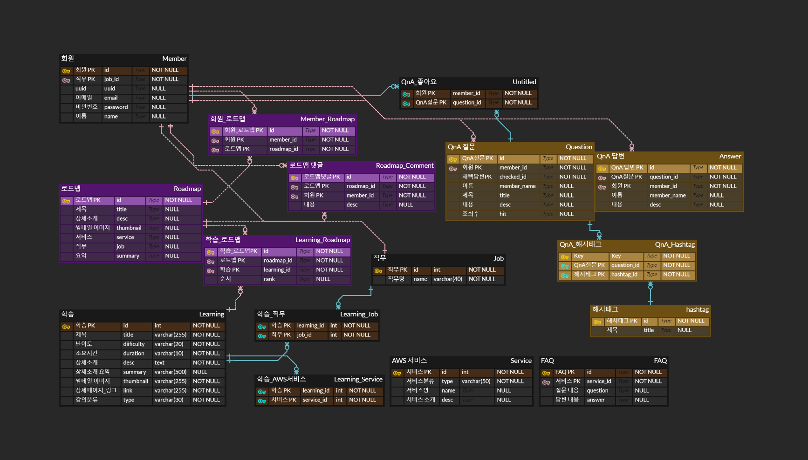
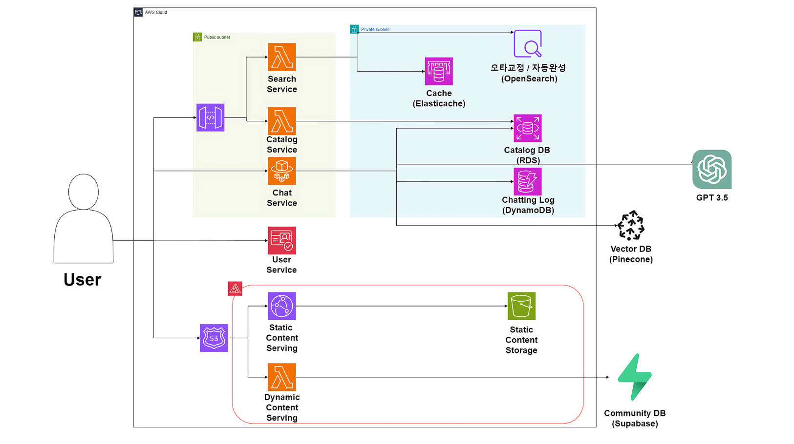

# AWS 클라우드 서비스를 친구처럼 편안하게, Cloudy

#### SSAFY 10기 S207 AWS 기업 연계 프로젝트

## ✨ 프로젝트 개요

### 1. 프로젝트명

- Cloudy

### 2. 프로젝트 기간

- 2024.04.08 ~ 2024.05.17

### 3. 프로젝트 주제

- AWS 서비스를 활용한 AWS Digital Learning Platform 개발

### 4. 서비스 타겟층

- AWS 서비스 활용 및 자격증 취득을 위한 학습에 관심이 있는 한국인

### 5. 프로젝트 주요 기능

### 🧑 회원 및 사용자 커뮤니티

- 소셜 및 이메일 회원가입
  - 이메일 인증코드를 통한 계정 인증 및 중복 가입 방지
  - 가입 시 유저 직종 및 관심 서비스 정보를 입력받아 유저의 관심사에 맞는 추천 정보 제공
- 로그인 / 로그아웃
  - JWT 토큰을 통한 세션 관리 기능
  - 세션 만료 시 리프레쉬 토큰을 이용하여 토큰 재발급 가능
- 마이 페이지
  - 내 정보 조회 화면에서 정보 조회 및 관심 직무/서비스 변경 가능
  - 내가 작성한 글, 덧글, 내가 담아놓은 로드맵을 확인 가능
- 유저 커뮤니티
  - 유저 커뮤니티를 통해 문제 화면 및 코드를 공유하고 실시간으로 타 유저들에게서 답변을 받을 수 있음

### 🔎 검색

- 검색어 오타 교정
  - 사용자의 검색어 중 오타로 판단되는 단어를 인식하여 정상 검색어로 수정 후 검색 결과 제공
  - 변경 전 검색어의 검색 결과 페이지로 이동하는 기능 제공
- 검색어 자동 완성
  - 사용자의 검색어를 인식하여 자동완성 제시어 제공
  - 사용자들이 많이 검색한 단어를 데이터에 추가하여 제시어 추천 시 함께 추천되도록 함

### 📚 추천

- 강의/로드맵 주제 검색
  - VectorDB와 RDB를 활용하여 유저가 정확한 키워드를 몰라도 주제를 검색하는 것으로 관련 내용을 찾을 수 있도록 함
  - 부적절한 검색어에 대한 필터링 기능
- 추천 강의 제공
  - 로그인 후 학습/로드맵 검색 시 우디 Pick(학습)과 존 Pick(로드맵) 컴포넌트에서 각각의 검색 결과에 대한 추천 강의를 제공
  - 로그인 후 메인화면 접속 시 유저 등록 정보에 맞춘 로드맵/학습 추천 자료 제공

### 💭 챗봇

- 유저와 실시간 대응 가능한 AI 챗봇 제공
  - 강의 및 로드맵 추천, AWS 서비스 비용 산정, 학습 중 발생한 일반 질문사항 FAQ 대응 챗봇의 4종
  - 현재 학습 내용을 바탕으로 답변할 수 없는 질문을 받았을 경우 질의와 관련된 근거 자료를 조회 후 정확한 답변을 생성하여 제공
  - 부적절한 질문에 대한 필터링 기능
  - SSE (Server-Sent Events)를 활용하여 질문 후 답변을 받기까지 걸리는 시간을 줄이고, 유저에게 실시간으로 답변을 받고 있는 듯한 느낌을 주는 사용감 제공

## ✏️ 기술 특이점

### RAG 기반 추천 / 챗봇

- 검색 추천
  - 정확한 키워드를 입력하여 검색하는 것이 아닌 키워드 기반 검색을 사용함으로써, 질문의 맥락을 파악하고 사용자에게 그에 맞는 컨텐츠를 제공
  - 검색 품질을 향상시키기 위해 데이터 간 유사한 단어를 생성할 수 있도록 키워드 추출 후 정규화 계층 추가
  - 사용자 입력을 벡터로 변환 후 공통된 키워드를 비교하여 질문과 가장 유사한 데이터를 판단, 사용자에게 최종 반환
- 챗봇
  - GPT API를 활용하여 챗봇을 구성하였으며, 답변의 정확도를 높이기 위해 답변을 생성할 때 참고할 수 있는 정보를 DB에서 가져오는 작업을 수행함
  - 최근 채팅 내역, 공식 홈페이지의 FAQ, 공식 요금 문서, 강의 소개 정보를 벡터DB에서 전달하여 정확한 답변을 생성하도록 개선

### 오타 교정 / 자동 완성

- 정상 검색어, 단순 오타, 순서 변경 3가지 인자를 고려하여 자동 완성 실행
- 캐싱 레이어를 활용하여 응답 속도를 높였으며, 해당 과정 중 불필요한 검색어가 등록되는 것을 막기 위하여 의미 불명의 검색어는 제외

### 성능 개선

- 람다 성능 개선(서버리스)

  - 람다 실행 시 초반 Cold Start를 개선하기 위하여 Code 다운로드와 실행 환경 개선을 미리 실행

- 이미지 캐싱 개선
  - 이미지 로딩 속도를 단축하기 위하여 BE와 FE에 캐싱 레이어를 도입
  - 개선 전 LCP: 8초 -> 개선 후 LCP: 2.3초, 응답 시간 0.03초

## ✨ 서비스 화면

## 🚀 기술 스택

### Front-End

- Next.js `14`
- Typescript
- axios
- SCSS
- Jest
- StoryBook
- Zustand
- NextAuth
- AWS Cognito
- Prisma
- Zod

### Back-End

- Java `17`
- Spring Boot `3.2.4`
- SonarQube `4.3.1.3277`
- Spring Security
- JWT
- OpenAI API `(GPT)`
- OpenSearch
- AWS ElastiCache

### DB

- Redis
- AWS S3
- AWS RDS
- AWS DynamoDB
- MongoDB
- Pinecone
- Supabase

### Infra

- Jenkins
- AWS Lambda
- AWS Amplify
- AWS CloudFront
- AWS CloudWatch
- AWS Elastic Beanstalk

## 프로젝트 노션 페이지

[프로젝트 노션 페이지](https://www.notion.so/S207-51157c9cb2b34f04a4f61695eb118c68)

## 기능 명세

[기능 명세](https://www.notion.so/6a9bbecd7b23442e9222f680e01255a5?v=ea2ef6f4048e4bd1adce868a333d06ff)

## API 명세

[API 명세](https://www.notion.so/9311c70962b64557bb356fced2543745?v=b279e1c8466f42f89d6f713ac69de15c)

## ERD

## System Architecture

## 역할 분담

| 이름   | 역할     | 업무 |
| ------ | -------- | ---- |
| 김한주 | 팀장, BE |      |
| 서지현 | BE       |      |
| 이하늬 | BE       |      |
| 김내림 | FE       |      |
| 백민정 | FE       |      |
| 전상혁 | FE       |      |
